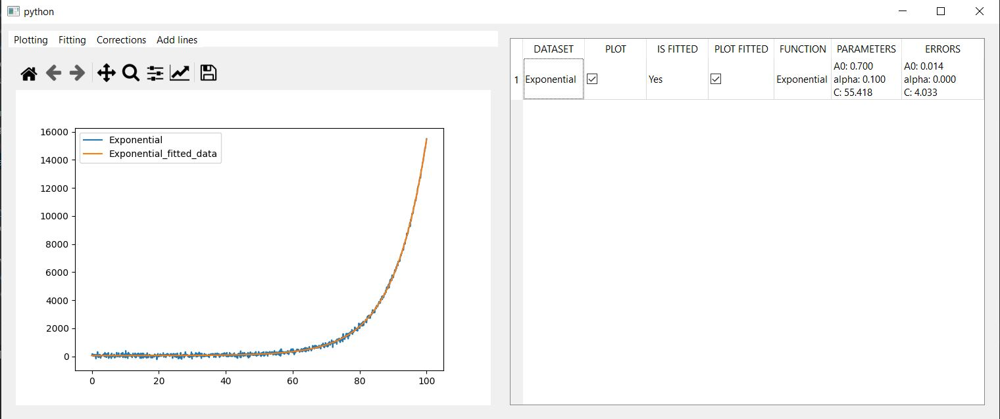

# **Plotting_window**
## Purpose
Repository was created to provide a graphical user interface to allow data to 
be plotted and fitted quickly without having to write any scripts. GUI is written
in python using GUI library QT. Numpy and Scipy libraries are utilised for short 
computation times. 

## Functionality

### Plotting

GUI currently has the functionality to read data from .txt and .csv files and 
plotting data in figure. Work is being done to expand files that can be read and 
extend to allow user defined functions to read and preprocess data.

### Fitting 

GUI is intended to be able fit function to loaded data, user defined functions are
intended to be allowed.

### Correction

Functionality is intended to be added which will allow corrections to be applied to
data such as:
- Corrections to x-axis
- Transformation of y-axis
- Filtering noise
- Removing the background

### Add lines
 This adds a variety of lines and shapes to plot so they can be saved for other purposes.
 